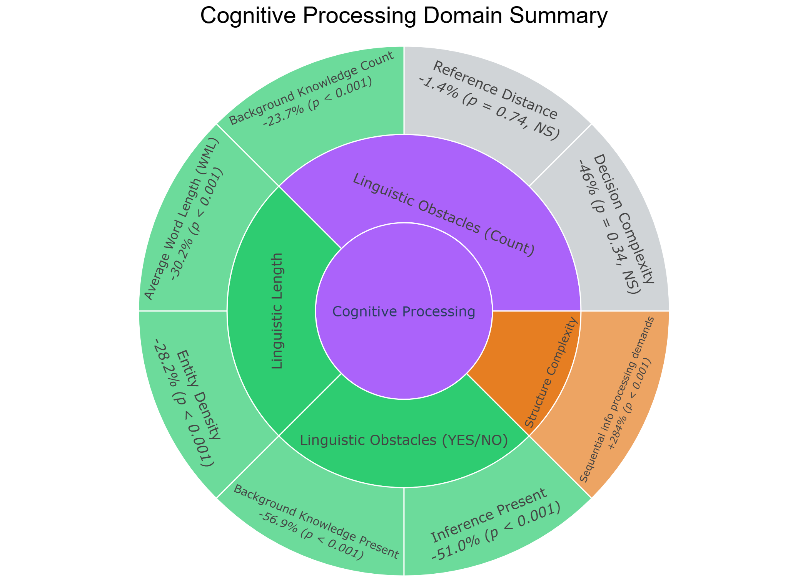
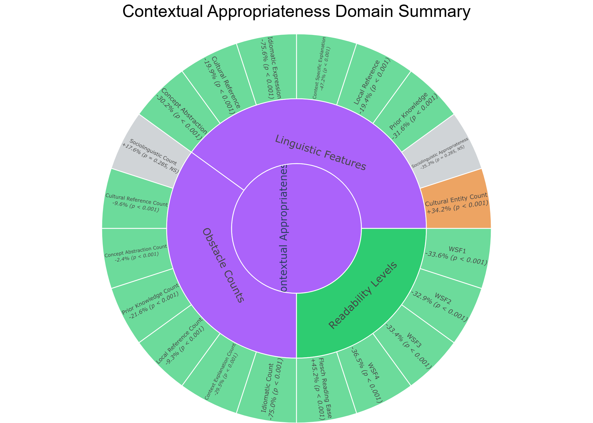
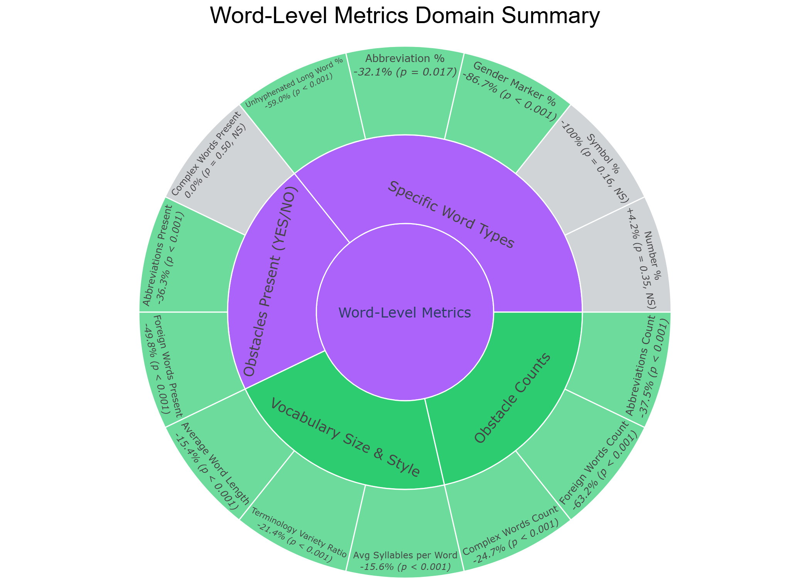
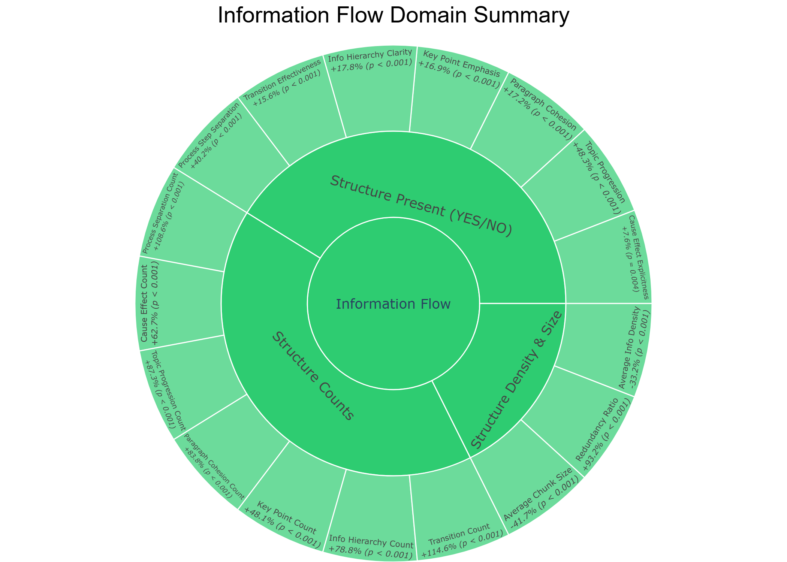
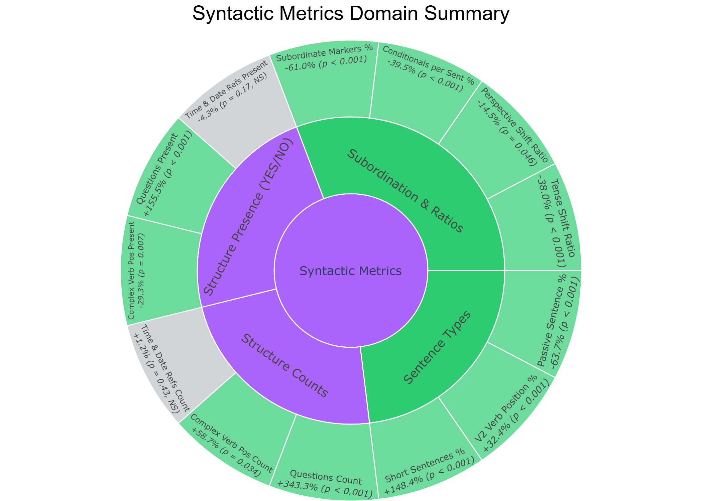
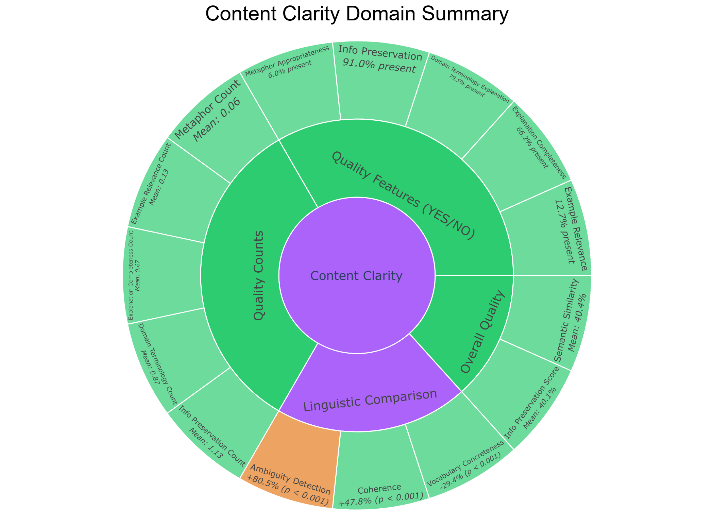

# 🇩🇪 Leichte Sprache AI Evaluation & Analysis

An evaluation framework and analysis dashboard built to assess how effectively AI models translate standard German texts into **Leichte Sprache** (Easy German). The project evaluates performance across 6 distinct linguistic domains using rigorous statistical validation (T-Tests, P-Values, Standard Deviations) and interactive visualizations.

---

## 📸 Domain Visual Summaries (Sunburst Charts)

To summarize the analysis at a high level, we generated hierarchical sunburst charts for each of the six linguistic dimensions. 
* **Emerald Green** slices indicate metrics that were successfully and significantly simplified.
* **Orange** slices indicate helpful explanations that the AI intentionally added.
* **Light Gray** slices indicate no statistically significant change (which is expected for factual references like dates or numbers).

| 🧠 Cognitive Complexity | 🌍 Contextual Appropriateness |
| :---: | :---: |
|  |  |

| 📝 Word-Level Metrics | 🔄 Information Flow |
| :---: | :---: |
|  |  |

| 🔀 Syntactic Metrics | 🔍 Content Clarity |
| :---: | :---: |
|  |  |

---

## 🚀 Key Features

- **6-Domain Evaluation Framework:** Comprehensive analysis covering Cognitive, Contextual, Word-Level, Information Flow, Syntactic, and Clarity dimensions.
- **Statistical Validation:** Full integration of Two-Sample Equal Variance T-Tests (Type 2) to evaluate statistical significance ($p$-values).
- **Interactive Visualizations:** High-resolution Plotly Sunburst Charts (saved as interactive HTML and PNG) for executive-level summaries.
- **Excel Analysis Dashboards:** Custom Excel summaries equipped with error-bar column charts, Box & Whisker plots, and automated statistics.

---

## 📊 Evaluation Domains & Key Metrics

### 1. Cognitive Complexity
* **Average Word Length (WML)** (letters per word)
* **Entity Density**
* **Sequential Information Processing Demands** (Obstacles count)
* **Decision Complexity & Reference Distance**
* **Inference Count & Background Knowledge Count**

### 2. Contextual Appropriateness
* **Readability Levels:** Wiener Sachtextformel (WSF 1-4) & Flesch Reading Ease
* **Linguistic Obstacles:** Idioms, metaphors, prior knowledge, and local/cultural reference occurrences.

### 3. Word-Level Metrics
* **Unhyphenated Long Words %** (German compound words)
* **Vocabulary range:** Terminology Variety Ratio
* **Abbreviation, Number, Symbol, and Gender Marker %**
* **Average Syllables per Word**

### 4. Information Flow
* **Average Chunk Size** (words per segment)
* **Information Density**
* **Redundancy Ratio** (word repetitions to simplify context)
* **Logical Structuring:** Transitions, process step separations, and topic progression count.

### 5. Syntactic Metrics
* **Sentence lengths:** Short sentences %
* **Grammatical difficulty:** Passive voice percentage
* **Verb Positions:** V2 Verb position percentage
* **Consistency:** Perspective and tense shift ratios
* **Clause Complexity:** Subordinate markers % & conditionals count

### 6. Content Clarity
* **Coherence & Vocabulary Concreteness**
* **Ambiguity Detection**
* **AI Quality Metrics:** Semantic similarity & Information preservation scores

---

## 📂 Repository Structure

```text
├── .ipynb_checkpoints/
├── visualizations/                     # Plotly sunburst HTML & PNG exports
│   ├── clarity_sunburst.png
│   ├── cognitive_sunburst.png
│   ├── contextual_sunburst.png
│   ├── info_flow_sunburst.png
│   ├── syntactic_sunburst.png
│   └── word_level_sunburst.png
├── Cognitive Processing_batch.py       # Domain-specific batch scripts
├── Content_Clarity_batch.py
├── Contextual Appropriateness_batch.py
├── Word-Level_Requirements_batch.py
├── information_flow_batch.py
├── syntactic_structure_batch.py
├── cognitive_dataset_metrics.xlsx      # Completed Excel summaries and charts
├── Contextual_Appropriateness_dataset_metrics.xlsx
├── dataset_word_level_metrics.xlsx
├── information_flow_dataset_metrics.xlsx
├── dataset_syntactic_metrics.xlsx
├── Content_Clarity_dataset_metrics.xlsx
├── *.ipynb                             # Jupyter notebooks for data processing
└── README.md
```

---

## 🛠️ How to Generate the Visualizations

Each domain's interactive Plotly charts can be generated by running the helper scripts located in the repository:

```bash
# Generate the Syntactic sunburst chart
python scratch/generate_syntactic_sunburst.py

# Generate the Information Flow sunburst chart
python scratch/generate_info_flow_sunburst.py
```
The output images will be saved directly into the `visualizations/` folder.

---

## 👥 Authors & Contributors

* **Rahul Gupta** - *Lead Analyst & Developer* - [@rahulgupta41](https://github.com/rahulgupta41)
* **Vivekanandhan Viswanathan** - *Co-Author & supervisor* - [LinkedIn](https://www.linkedin.com/in/vivekanandhan-viswanathan/)

---

## 📚 Dataset Credits

The evaluation dataset utilized in this project was sourced from the open-source **[Simple German Corpus](https://github.com/buschmo/Simple-German-Corpus)** by buschmo. We thank the authors for making this corpus available for research.

